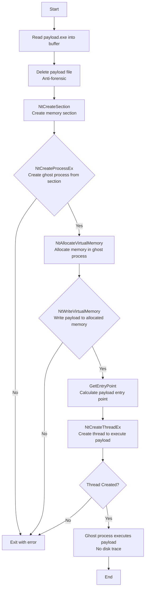

# Process Herpaderping: Transactional Ghost Process Injection

## Technique

**MITRE ATT&CK:** T1055 - Process Injection (Herpaderping Variant)

_Note: While similar to Process Doppelgänging (T1055.013), Herpaderping does not use TxF to overwrite a legitimate executable. Instead, it creates a ghost process directly from a memory section without file manipulation, making it a distinct evasion technique._

## Description

This tool creates a "ghost" process using memory sections and potential transaction manipulation, then injects an executable payload into it. Unlike Process Doppelgänging, it does not overwrite a legitimate file with malicious code via TxF. Instead, the payload is loaded from a separate file into a memory section, the file is deleted for anti-forensics, and a process is spawned from the section. The resulting process has no on-disk footprint and appears as a phantom execution, evading detection.

## Execution Flow



### Steps Detail

| Step | API Call                  | Description                                     |
| ---- | ------------------------- | ----------------------------------------------- |
| 1    | `CreateFile` / `ReadFile` | Read payload EXE from file into memory buffer   |
| 2    | `DeleteFile`              | Self-delete payload file for anti-forensics     |
| 3    | `NtCreateSection`         | Create memory section containing payload        |
| 4    | `NtCreateProcessEx`       | Create ghost process from memory section        |
| 5    | `NtAllocateVirtualMemory` | Allocate executable memory in ghost process     |
| 6    | `NtWriteVirtualMemory`    | Write payload to allocated memory               |
| 7    | `NtCreateThreadEx`        | Create thread to execute payload at entry point |

## Payload Requirements

- Format: Portable Executable (.exe), not raw shellcode
- Architecture: x64
- Position-independent: No hard-coded addresses
- Entry point: Standard PE entry point
- Self-contained: No external dependencies

## Usage

```
CWLHerpaderping.exe

```

(Note: Payload must be placed at `C:\temp\payload64.exe` before execution)

## IOCs for Detection

- NTFS transaction manipulation without visible file operations
- Process creation from memory section (no ImagePath)
- Cross-process memory allocation with `NtAllocateVirtualMemory`
- Thread creation pointing to unbacked executable memory
- API sequence: NtCreateSection → NtCreateProcessEx → NtWriteVirtualMemory → NtCreateThreadEx

## Log Sources Coverage

| Data Component                | Log Source                           | Channel/Event                                            | Detected?                     |
| ----------------------------- | ------------------------------------ | -------------------------------------------------------- | ----------------------------- |
| Process Creation (DC0032)     | WinEventLog:Sysmon                   | EventCode=1                                              | ❌ No (ghost process)         |
| Process Access (DC0035)       | WinEventLog:Sysmon                   | EventCode=10                                             | ✅ Yes                        |
| Process Modification (DC0020) | WinEventLog:Sysmon                   | EventCode=8                                              | ❌ No (no CreateRemoteThread) |
| Module Load (DC0016)          | WinEventLog:Sysmon                   | EventCode=7                                              | ❌ No (EXE payload)           |
| OS API Execution (DC0021)     | etw:Microsoft-Windows-Kernel-Process | NtCreateSection, NtCreateProcessEx, NtWriteVirtualMemory | ✅ Yes                        |
